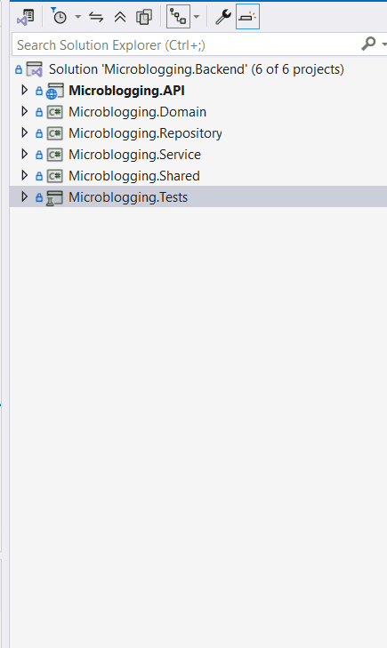
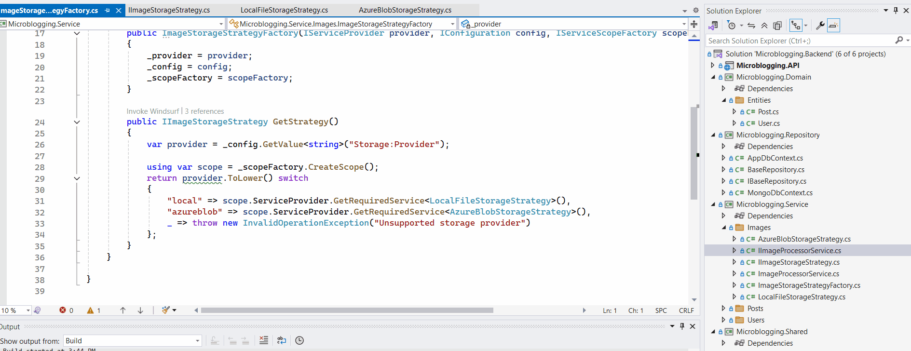
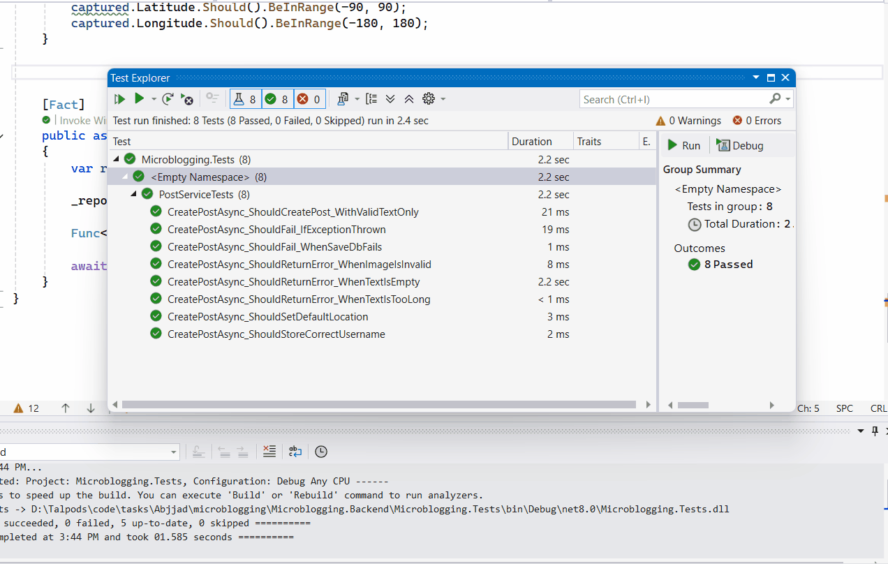
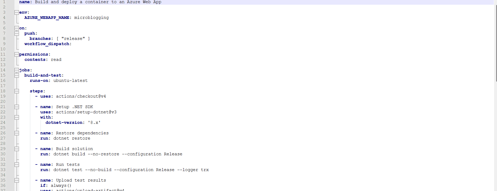

# Microblogging Platform

A responsive microblogging application that allows users to post text and upload images. Built with **.NET 8**, **React (TypeScript)**, and **MongoDB**, the system is designed to handle asynchronous image processing and responsive delivery for optimal user experience across all screen sizes.


---

##  Run with Docker Compose

From the backend folder, execute:

```bash
docker compose up --build
```


### Access URLs

- **Frontend**: [http://localhost:3000](http://localhost:3000)
- **Backend (Swagger)**: [http://localhost:8080/index.html](http://localhost:8080/index.html)

---

##  Project Structure

```
project-root/
├── backend/                        # .NET 8 solution and source code
│   ├── Microblogging.API
│   ├── Microblogging.Service
│   ├── Microblogging.Repository
│   ├── Microblogging.Domain
│   ├── Microblogging.Shared
│   └── wwwroot/uploads/            # Hosted images (original and resized)
├── frontend/                       # React + TypeScript application
│   └── public/
│   └── src/
│       └── templates/TimelinePage.tsx
└── abjaad-microblogging.gif       # Demo animation
```

---

##  Why This Tech Stack

### .NET 8
- **Stability & LTS**: .NET 8 is the current **Long-Term Support (LTS)** version, recommended for production systems.
- **Rich background processing support** using `IHostedService`.
- Full support for `Minimal APIs`, `File Upload`, and `Dependency Injection` patterns.
- Extensive ecosystem support (Docker images, templates, tools).

### React (not ASP.NET MVC)
- **Dynamic frontend behavior** with instant visual feedback, required for modern UX (e.g., image previews, responsive images).
- Better control over **state management** and image loading lifecycle.
- Improved developer experience for frontend-heavy apps via modular components.

### MongoDB (NoSQL)
Faster to iterate for prototyping and JSON-friendly schema works well with image metadata and post content.


---

##  Image Upload & Rendering

- Original image is uploaded **immediately** and returned in the response.
- A **background task** resizes the image into variants (`400w`, `800w`, `1200w`) for different screen sizes.
- Frontend uses the HTML `<picture>` element with `media` queries to serve the appropriate image size depending on the device width.
- Optimized image delivery using `WebP` format.

---

##  Design Patterns Used

###  Strategy Pattern
Used to encapsulate **image storage logic**. This makes the system easily extendable to:
- Switch between **Local Disk**, **Azure Blob**, **AWS S3**, etc.
- Implement logic per storage backend without changing core upload flow.

###  Repository Pattern
Abstracts database operations, allowing MongoDB to be easily swapped or mocked during tests.

###  Queue-Based Background Processing
Implemented using `BackgroundService` in .NET, it enables non-blocking image resizing after original upload is completed.

###  Cache-Busting Strategy
Appends timestamp to image URLs to **prevent browser caching** of resized variants.

###  Responsive Image Delivery
Uses HTML `<picture>` to load best-fit image based on device size, improving **performance** and **UX**.

---


---

##  Frontend Features (React)

- Built with **React + TypeScript**
- Responsive layout
- Upload images with preview and fallbacks
- Loader shown until the resized image is ready
- Cache-busting to ensure fresh images appear on post
- Timeline updates seamlessly after post submission
- `.env` support for dynamic backend URLs

---

##  Backend Features (.NET 8)

- Minimal API for posting and retrieving tweets
- MongoDB integration for storing posts
- File upload via `IFormFile`
- Background image resizing to 3 sizes (WebP format)
- Docker volume for persistent upload directory
- Full Swagger documentation for available endpoints

---

##  Tasks Completed

- [x] **Post text limited to 140 characters**
- [x] **Image upload (JPG, PNG, WebP)** with size limit of 2MB
- [x] **Original image is returned immediately** after upload
- [x] **Images are converted to WebP** format and resized to multiple dimensions (`400w`, `800w`, `1200w`) using a background task
- [x] **Responsive rendering** via `<picture>` element, selecting optimal image for screen size
- [x] **Fallback to original image** if background resizing is not yet completed
- [x] **Posts include random geographic coordinates**, sent automatically to backend
- [x] **Timeline view** displays all posts sorted by creation time (latest first)
- [x] **Image always shown if present** in post, even during processing
- [x] **Loader UI implemented** while waiting for resized image to be available
- [x] **Prevents flash/missing image issue** via image-ready detection
- [x] **Post auto-refresh** with delay after image is saved
- [x] **Authentication via OAuth 2.0 and JWT**
- [x] **seeder login credintials** for username/password default (Username : abjjad , Password : 123456)
- [x] **Only logged-in users can post and view timeline**
- [x] **Backend implemented using .NET 8 (LTS)** and RESTful APIs
- [x] **Frontend developed as SPA using React (TypeScript)**
- [x] **Flexible storage design via Strategy Pattern** for Azure Blob or local storage
- [x] **MongoDB** used as the NoSQL database
- [x] **Dockerized full stack**, includes proper `Dockerfile` and `docker-compose.yml`
- [x] **Azure Pipeline YAML** file included for CI/CD
- [x] **Demo animation (.gif)** provided to showcase UX behavior
- [x] **Unit tests** included for core components
- [x] **Essential integration tests** written to validate critical paths

---

##  Unit Test

Add Unit test for a saftey network to any new push - the test cases runs as per pipline CICD works 

---

---

##  CI/CD

CI configured via `azure-pipelines.yml`. Builds the project and runs tests on commit.

---



---

##  Environment Variables

Example `.env` for frontend:

```
REACT_APP_API_BASE_URL=http://localhost:8080/api
REACT_APP_BASE_URL=http://localhost:8080
```

These values are injected at build time using Docker ARGs.

---

##  Future Enhancements

- **Integrate Hangfire for Background Tasks**  
  Replace the current manual background image resizing with Hangfire to manage tasks more reliably with retries, monitoring dashboard, and scheduling capabilities.

- **Using ELK**  
  Adding ELK as docker container to access runtime logs for better monitoring and bugs fix .
  
- **Improve Project Design and Architecture**  
  Refactor the current service and controller layers to adopt a more scalable Clean Architecture approach. This includes better separation of business rules, use cases, and interfaces to support larger teams and more features.

- **Implement Role-Based Authorization**  
  Extend the authentication system to support roles such as `Admin`, `Moderator`, and `User`, allowing fine-grained access control for sensitive operations and admin panels.

- **Scalable Backend Design (Bucket-Based Sharding)**  
  Enhance the backend to support millions of users by:
  - Implementing user bucket/sharding logic to distribute load.
  - Indexing MongoDB collections for optimal read/write performance.
  - Introducing caching (e.g., Redis) for timeline and frequent reads.

- **User Profile Picture Support**  
  Allow users to upload and manage profile pictures, which will be displayed next to their posts and on their profile.

- **Add Logout Functionality**  
  Implement logout logic by invalidating JWT on the client side and adding token expiration awareness for better session control.


